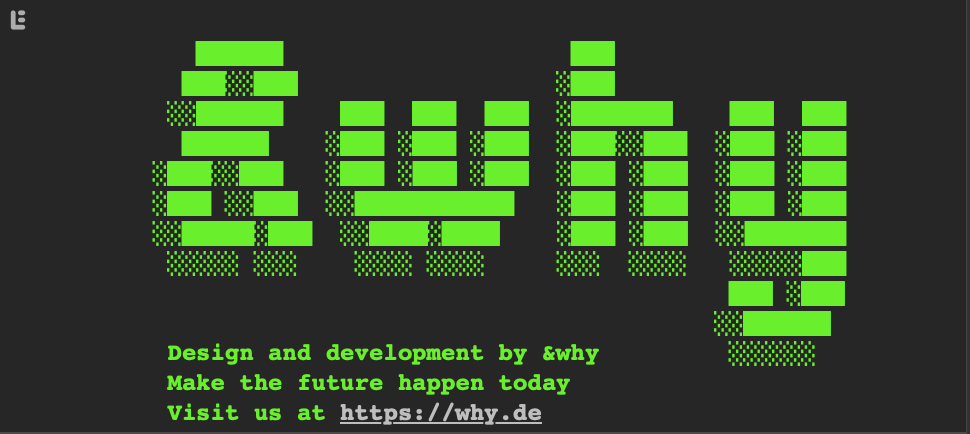

## &why console signature

What is this?

- `console-signature.js` prints an &why signature to the dev console.

How to use?

- The code is copy-paste-able and ready to be inserted into any project. It does not have any dependencies.
- To test it, simply copy-paste the content of `console-signature.js` into your dev console.

How does it work?

- In `console-signature.js` there are two versions of the signature: An animated version and a static one. Currently the animated version only works in chrome based browsers, so there is a condition that will pick the right one depending on the browser.

